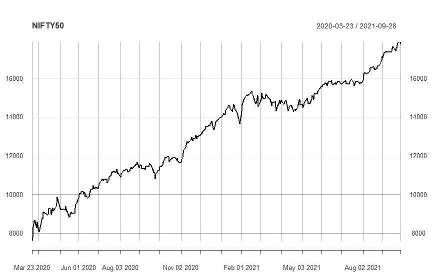
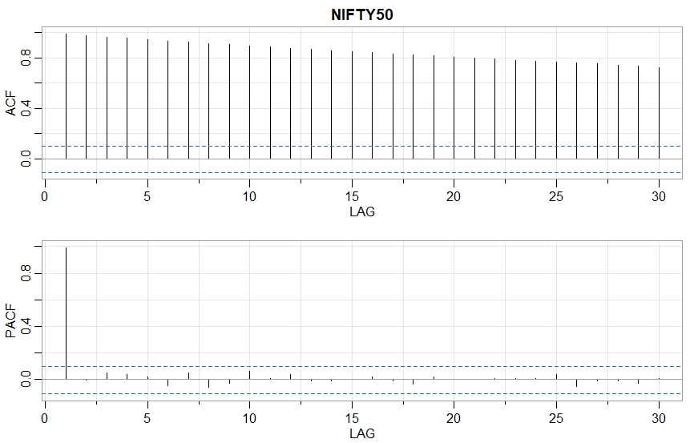
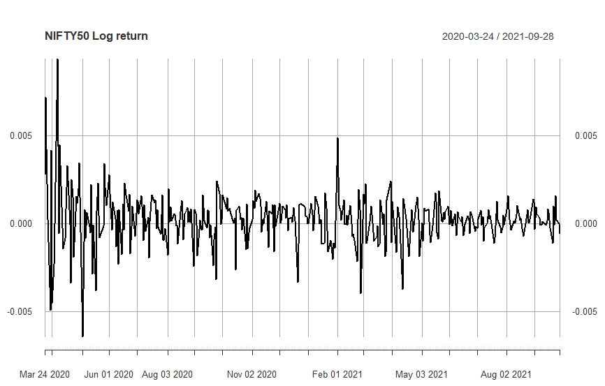
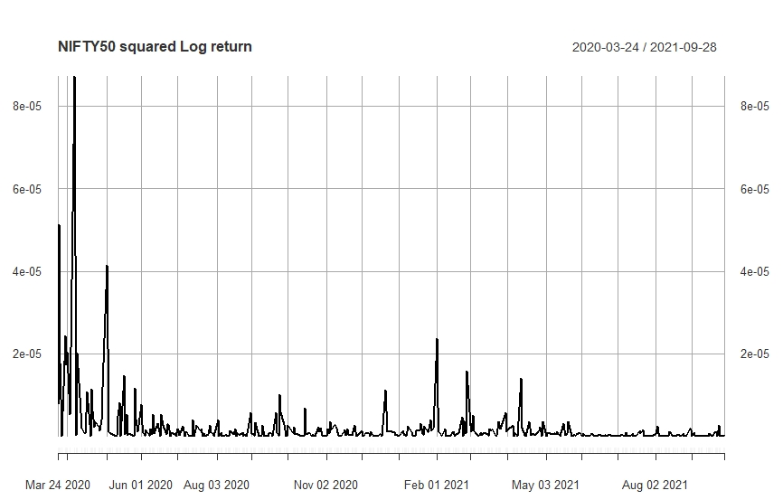
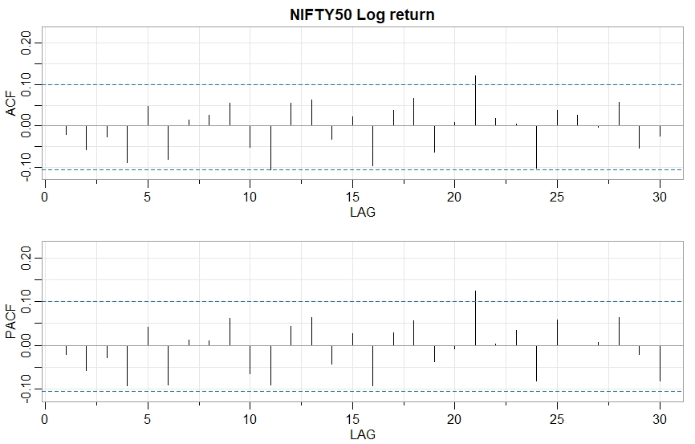
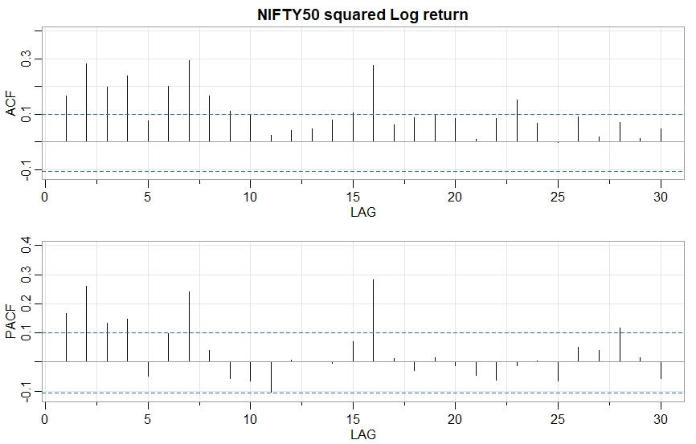
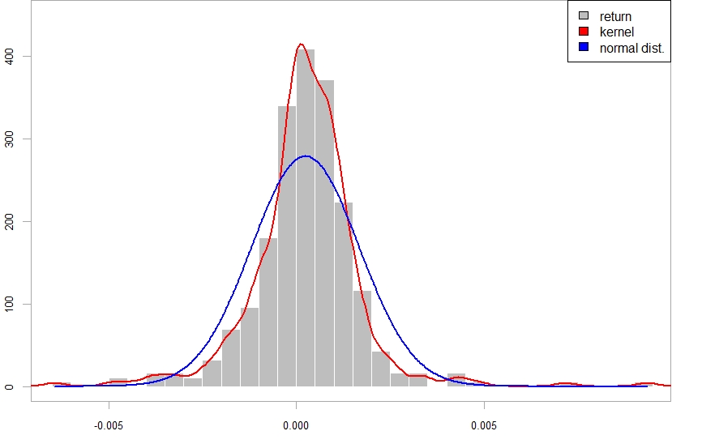
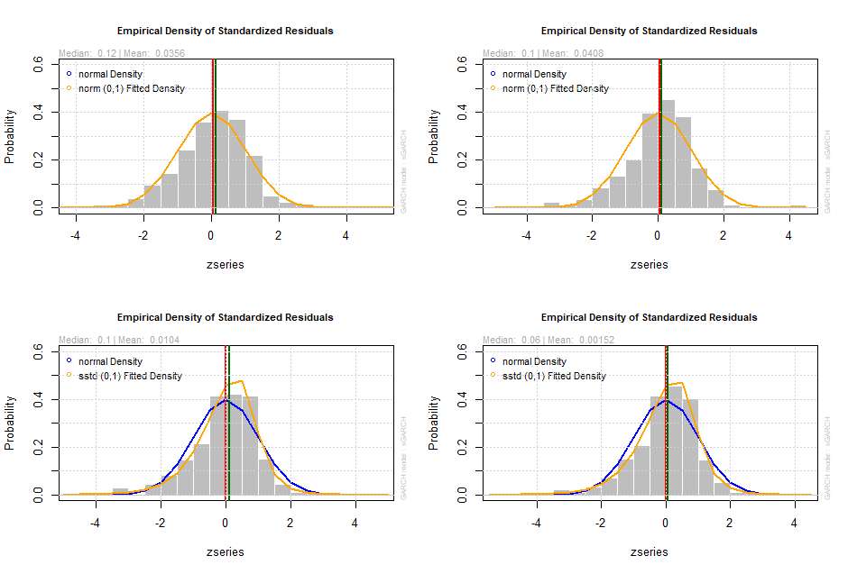

## Code And Workings

### Imports

<details>
  <summary>Click to expand!</summary>
  
  ```r
library(prophet)
library(quantmod)
library(forecast)
library(tseries)
library(timeSeries)
library(dplyr)
library(fGarch)
library(gridExtra)
library(readxl)
library(astsa)
library(urca)
library(rugarch)
library(quantmod)
library(dplyr)
library(tidyverse)
library(tseries)
library(rugarch)
library(xts)
library(PerformanceAnalytics)
library(lubridate) 

  ```
  </details>


### Data Loading, Cleaning and Data Preparation
<details>
  <summary>Click to expand!</summary>
  
  ```r
nifty <- read_excel("nifty.xlsx")
niftyw<-nifty[857:1234,]

  ```
  </details>
  
  
## Nifty 50

  <details>
  <summary>Click to expand!</summary>
  
  ```r
niftyxts<-xts(x=as.numeric(niftyw$Close),order.by = ymd(niftyw$Date))

chartSeries(niftyxts)

  ```
  </details>
  
  
 

  
  <details>
  <summary>Click to expand!</summary>
  
  ```r
acf2(niftyxts)

  ```
  </details>
 
  
  

  <details>
  <summary>Click to expand!</summary>
  
  ```r
  summary(ur.df(niftyxts, type="none",lag=1))

  ```
  </details>
  
  
  ```r
  ############################################### 
  # Augmented Dickey-Fuller Test Unit Root Test # 
  ############################################### 

  Test regression none 


  Call:
  lm(formula = z.diff ~ z.lag.1 - 1 + z.diff.lag)

  Residuals:
      Min      1Q  Median      3Q     Max 
  -596.75  -66.97    6.01   92.08  696.39 

  Coefficients:
              Estimate Std. Error t value Pr(>|t|)   
  z.lag.1    0.0017829  0.0005885   3.030  0.00262 **
  z.diff.lag 0.0141279  0.0517674   0.273  0.78507   
  ---
  Signif. codes:  0 ‘***’ 0.001 ‘**’ 0.01 ‘*’ 0.05 ‘.’ 0.1 ‘ ’ 1

  Residual standard error: 150.8 on 374 degrees of freedom
  Multiple R-squared:  0.02565,	Adjusted R-squared:  0.02044 
  F-statistic: 4.922 on 2 and 374 DF,  p-value: 0.00776


  Value of test-statistic is: 3.0297 

  Critical values for test statistics: 
        1pct  5pct 10pct
  tau1 -2.58 -1.95 -1.62
  ```
  
  
  <details>
  <summary>Click to expand!</summary>
  
  ```r
  niftyreturn = CalculateReturns(log(niftyxts))
  niftyreturn=niftyreturn[-c(1),]

  chartSeries(niftyreturn)
  chartSeries(niftyreturn**2)

  ```
  </details>
  
  
  

  
  <details>
  <summary>Click to expand!</summary>
  
  ```r
  acf2(niftyreturn)
  acf2(niftyreturn**2)
  ```
  </details>
  
  
  
  
  
  <details>
  <summary>Click to expand!</summary>
  
  ```r
  summary(ur.df(niftyreturn, type="none",lag=1))
  ```
  </details>
  
  ```r
  ############################################### 
# Augmented Dickey-Fuller Test Unit Root Test # 
############################################### 

Test regression none 


Call:
lm(formula = z.diff ~ z.lag.1 - 1 + z.diff.lag)

Residuals:
       Min         1Q     Median         3Q        Max 
-0.0063091 -0.0003262  0.0002651  0.0009271  0.0091561 

Coefficients:
           Estimate Std. Error t value Pr(>|t|)    
z.lag.1    -1.04889    0.07036 -14.909   <2e-16 ***
z.diff.lag  0.03057    0.04980   0.614     0.54    
---
Signif. codes:  0 ‘***’ 0.001 ‘**’ 0.01 ‘*’ 0.05 ‘.’ 0.1 ‘ ’ 1

Residual standard error: 0.001401 on 373 degrees of freedom
Multiple R-squared:  0.5265,	Adjusted R-squared:  0.5239 
F-statistic: 207.4 on 2 and 373 DF,  p-value: < 2.2e-16


Value of test-statistic is: -14.9086 

Critical values for test statistics: 
      1pct  5pct 10pct
tau1 -2.58 -1.95 -1.62
  ```
  

  <details>
  <summary>Click to expand!</summary>
  
  ```r
  chart.Histogram(niftyreturn,methods = c("add.density","add.normal"),colorset = c("grey","red","blue"))
  legend("topright",legend=c("return","kernel","normal dist."),fill=c("grey","red","blue"))
  ```
  </details>
  
  

  
  
  
### Best p,q and P,Q finding for ARMA(p,q) + GARCH(P,Q)
  
  <details>
  <summary>Click to expand!</summary>
  
  ```r
    NIF_AIC_norm<-c()
NIF_BIC_norm<-c()


NIF_Big_norm <-c()
name_vec<- c()


for (a in seq(0,4)){
  for (b in seq(0,4)){
    for (i in seq(1,5)){
      for (j in seq(1,5)){
        try(k <- ugarchspec(mean.model = list(armaOrder=c(a,b)),variance.model = list(model="sGARCH",garchOrder=c(i,j)),distribution.model="sstd"))
        try(l <-ugarchfit(data=niftyreturn,spec = k,out.sample = 20))
        try({NIF_AIC_norm<- c(NIF_AIC_norm,infocriteria(l)[1])
            NIF_BIC_norm<- c(NIF_BIC_norm,infocriteria(l)[2])
            name_vec<- c(name_vec,paste(a,b,i,j))})
      }
    }

  }
}


NIF_AIC_norm

NIF_Big_norm <- data.frame(AMG=name_vec,
                           AIC=NIF_AIC_norm,
                           BIC=NIF_BIC_norm)

  ```
  </details> 

## Suggesting Different models:  
  
### Suggesting two models for least AIC, BIC and AICc values for normal distribution:
  * Considering AIC, we get the model ARMA(3,4) + GARCH(3,4)
  * Considering BIC and AICc, we get the model ARMA(0,0) + GARCH(1,1)
  
### Suggesting two models for least AIC, BIC and AICc values for skewed student's-t distribution:
  * Considering AIC, we get the model ARMA(3,2) + GARCH(3,1)
  * Considering BIC and AICc, we get the model ARMA(0,0) + GARCH(1,1)
  
#### Models with normal distribution:
  <details>
    <summary> Click to expand! </summary>
    
    ```r
    niftyspec_1<-ugarchspec(mean.model = list(armaOrder=c(3,4)),variance.model = list(model="sGARCH",garchOrder=c(3,4)),distribution.model="norm")
    niftyfit_1<-ugarchfit(data=niftyreturn,spec = niftyspec_1,out.sample = 20)
    niftyfit_1
    ```
  </details>
  
  * Model 1:
  
  ```r
  *---------------------------------*
  *          GARCH Model Fit        *
  *---------------------------------*

  Conditional Variance Dynamics 	
  -----------------------------------
  GARCH Model	: sGARCH(3,4)
  Mean Model	: ARFIMA(3,0,4)
  Distribution	: norm 

  Optimal Parameters
  ------------------------------------
          Estimate  Std. Error     t value Pr(>|t|)
  mu      0.000172    0.000001  1.2522e+02  0.00000
  ar1    -1.441115    0.000433 -3.3273e+03  0.00000
  ar2    -1.412654    0.000377 -3.7439e+03  0.00000
  ar3    -0.817146    0.000301 -2.7122e+03  0.00000
  ma1     1.288876    0.000600  2.1484e+03  0.00000
  ma2     1.230236    0.000429  2.8665e+03  0.00000
  ma3     0.579737    0.000223  2.6033e+03  0.00000
  ma4    -0.225758    0.000123 -1.8402e+03  0.00000
  omega   0.000000    0.000001  2.3168e-02  0.98152
  alpha1  0.001997    0.054906  3.6379e-02  0.97098
  alpha2  0.036442    0.099570  3.6599e-01  0.71437
  alpha3  0.147265    0.167423  8.7960e-01  0.37908
  beta1   0.514385    0.973410  5.2844e-01  0.59720
  beta2   0.000004    1.029866  4.0000e-06  1.00000
  beta3   0.000005    0.297172  1.6000e-05  0.99999
  beta4   0.264305    0.313267  8.4371e-01  0.39883
  
  LogLikelihood : 1901.474 

  Information Criteria
  ------------------------------------

  Akaike       -10.563
  Bayes        -10.389
  ```
 
  <details>
    <summary>Click to expand!</summary>
  
  ```r
    niftyspec_2<-ugarchspec(mean.model = list(armaOrder=c(0,0)),variance.model = list(model="sGARCH",garchOrder=c(1,1)),distribution.model="norm")
    niftyfit_2<-ugarchfit(data=niftyreturn,spec = niftyspec_2,out.sample = 20)
    niftyfit_2
  ```
  </details>
  
  * Model 2:
  
  ```r
  *---------------------------------*
  *          GARCH Model Fit        *
  *---------------------------------*

  Conditional Variance Dynamics 	
  -----------------------------------
  GARCH Model	: sGARCH(1,1)
  Mean Model	: ARFIMA(0,0,0)
  Distribution	: norm 

  Optimal Parameters
  ------------------------------------
          Estimate  Std. Error  t value Pr(>|t|)
  mu      0.000146    0.000054  2.67491 0.007475
  omega   0.000000    0.000001  0.01159 0.990752
  alpha1  0.068877    0.017867  3.85506 0.000116
  beta1   0.920911    0.016247 56.68364 0.000000

  LogLikelihood : 1886.906 

  Information Criteria
  ------------------------------------

  Akaike       -10.548
  Bayes        -10.505
  ```
  
 #### Models with Skewed Students'-t distribution: 
  
  <details>
    <summary>Click to expand!</summary>
  
  ```r
    niftyspec_3<-ugarchspec(mean.model = list(armaOrder=c(3,2)),variance.model = list(model="sGARCH",garchOrder=c(2,1)),distribution.model="sstd")
    niftyfit_3<-ugarchfit(data=niftyreturn,spec = niftyspec_3,out.sample = 20)
    niftyfit_3
  ```
  </details> 
  
  * Model 3:
  
  ```r
  *---------------------------------*
  *          GARCH Model Fit        *
  *---------------------------------*

  Conditional Variance Dynamics 	
  -----------------------------------
  GARCH Model	: sGARCH(2,1)
  Mean Model	: ARFIMA(3,0,2)
  Distribution	: sstd 

  Optimal Parameters
  ------------------------------------
          Estimate  Std. Error   t value Pr(>|t|)
  mu      0.000186    0.000036  5.114080 0.000000
  ar1     1.129094    0.126642  8.915634 0.000000
  ar2    -0.357489    0.109457 -3.266033 0.001091
  ar3     0.031002    0.051719  0.599424 0.548890
  ma1    -1.136301    0.123884 -9.172294 0.000000
  ma2     0.275044    0.096977  2.836169 0.004566
  omega   0.000000    0.000001  0.006771 0.994597
  alpha1  0.050287    0.043967  1.143749 0.252728
  alpha2  0.032251    0.041469  0.777716 0.436736
  beta1   0.910963    0.042338 21.516201 0.000000
  skew    0.777774    0.057663 13.488276 0.000000
  shape   5.211924    1.218971  4.275677 0.000019

  LogLikelihood : 1909.688 

  Information Criteria
  ------------------------------------

  Akaike       -10.631
  Bayes        -10.501
  ```
  
  <details>
    <summary>Click to expand!</summary>
  
  ```r
    niftyspec_4<-ugarchspec(mean.model = list(armaOrder=c(0,0)) , variance.model = list(model="sGARCH",garchOrder=c(1,1)) , distribution.model="sstd")
    niftyfit_4<-ugarchfit(data=niftyreturn,spec = niftyspec_4,out.sample = 20)
    niftyfit_4
  ```
  </details> 
  
  * Model 4:
    
  ```r
    *---------------------------------*
    *          GARCH Model Fit        *
    *---------------------------------*

    Conditional Variance Dynamics 	
    -----------------------------------
    GARCH Model	: sGARCH(1,1)
    Mean Model	: ARFIMA(0,0,0)
    Distribution	: sstd 

    Optimal Parameters
    ------------------------------------
            Estimate  Std. Error   t value Pr(>|t|)
    mu       0.00018    0.000050  3.582255 0.000341
    omega    0.00000    0.000001  0.005671 0.995475
    alpha1   0.10154    0.101373  1.001663 0.316506
    beta1    0.89574    0.074747 11.983577 0.000000
    skew     0.79023    0.058032 13.617288 0.000000
    shape    5.30588    2.001145  2.651420 0.008015


    LogLikelihood : 1910.784 

    Information Criteria
    ------------------------------------

    Akaike       -10.671
    Bayes        -10.606
  ```

  ### Comparing 4 Models:
  
  <details>
    <summary>Click to expand!</summary>
  
  ```r
    par(mfrow=c(2,2))
    plot(niftyfit_1,which=8)
    plot(niftyfit_2,which=8)
    plot(niftyfit_3,which=8)
    plot(niftyfit_4,which=8)
  ```
  </details>  
 
  
  
  <details>
  <summary>Click to expand!</summary>
  
  ```r
  ```
  </details>
  
  
