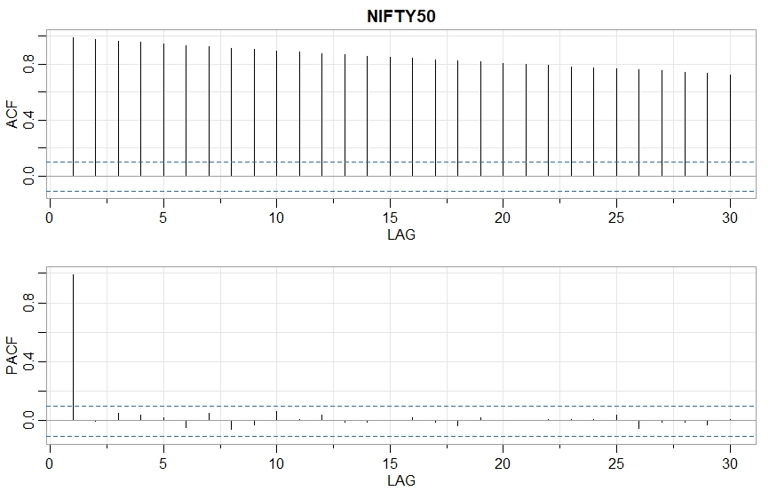

## Code And Workings

### Imports

<details>
  <summary>Click to expand!</summary>
  
  ```r
library(prophet)
library(quantmod)
library(forecast)
library(tseries)
library(timeSeries)
library(dplyr)
library(fGarch)
library(gridExtra)
library(readxl)
library(astsa)
library(urca)
library(rugarch)
library(quantmod)
library(dplyr)
library(tidyverse)
library(tseries)
library(rugarch)
library(xts)
library(PerformanceAnalytics)
library(lubridate) 

  ```
  </details>


### Data Loading, Cleaning and Data Preparation
<details>
  <summary>Click to expand!</summary>
  
  ```r
nifty <- read_excel("nifty.xlsx")
dax <- read_excel("dax.xlsx")
dow_jones <- read_excel("dow_jones.xlsx")
nikkei <- read_excel("nikkei.xlsx")

niftyw<-nifty[857:1234,]
daxw<-dax[878:1263,]
dow_jonesw<-dow_jones[960:1344,]
nikkeiw<-nikkei[849:1220,]

  ```
  </details>
  
  
## Nifty 50

  <details>
  <summary>Click to expand!</summary>
  
  ```r
niftyxts<-xts(x=as.numeric(niftyw$Close),order.by = ymd(niftyw$Date))

chartSeries(niftyxts)

  ```
  </details>
  
  
 

  
  <details>
  <summary>Click to expand!</summary>
  
  ```r
acf2(niftyxts)

  ```
  </details>
 
  
  
  
  <details>
  <summary>Click to expand!</summary>
  
  ```r


  ```
  </details>
